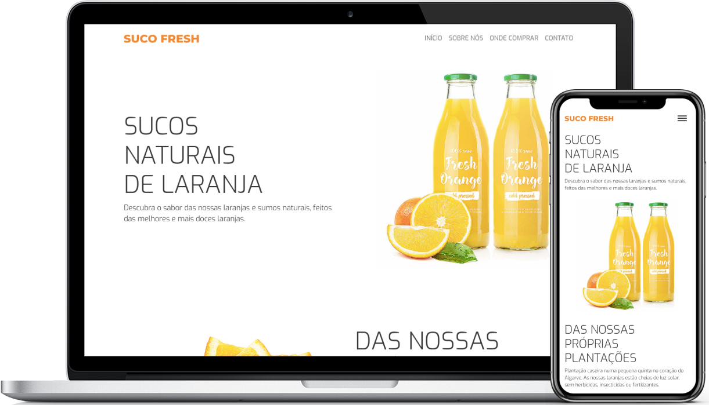

<h1 align="center">
    
</h1>

  <a href="#-tecnologias">Tecnologias</a>&nbsp;&nbsp;&nbsp;|&nbsp;&nbsp;&nbsp;
  <a href="#-projeto">Projeto</a>&nbsp;&nbsp;&nbsp;|&nbsp;&nbsp;&nbsp;
  <a href="#-layout">Start Projeto</a>&nbsp;&nbsp;&nbsp;|&nbsp;&nbsp;&nbsp;
  <a href="#-licença">Licença</a>

    
    
    

 

  

## 🚀 Tecnologias

Esse projeto foi desenvolvido com as seguintes tecnologias:

- [HTML5](https://htmlreference.io/)
- [CSS3](https://cssreference.io/)
- [Bootstrap](https://getbootstrap.com/)
- [Javascript](https://developer.mozilla.org/pt-BR/docs/Web/JavaScript)
- [Node.js](https://nodejs.org/en/)
- [Vue](https://vuejs.org/)
- [Vue Router](https://router.vuejs.org/)
- [Heroku](https://www.heroku.com/)

## 💻 Projeto

Suco Fresh é uma indústria especializada na produção de sucos clarificados concentrados e polpas concentradas. Nossa alta tecnologia permite a entrega de produtos envasados assepticamente, garantindo a preservação das características das frutas, alta qualidade e redução com custos de armazenagem.

## 🚀 Start Projeto

- Clone o repositório
- Instale as dependências com `npm install`
- Inicie o servidor com `npm run serve`

Agora você pode acessar [`localhost:8080`](http://localhost:8080) do seu navegador.

## 🌐 Implementação no Netlify

Acesse [`https://web-suco-fresh.herokuapp.com/`](https://web-suco-fresh.herokuapp.com/) do seu navegador.

## 📝 Licença

Esse projeto está sob a licença MIT. Veja o arquivo [LICENSE](LICENSE.md) para mais detalhes.

---

Feito com por Jessé Martins
